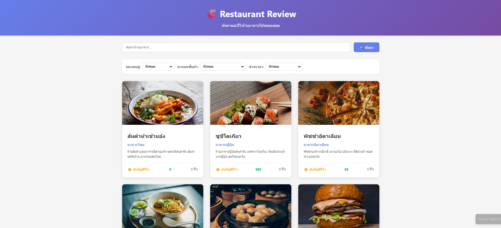
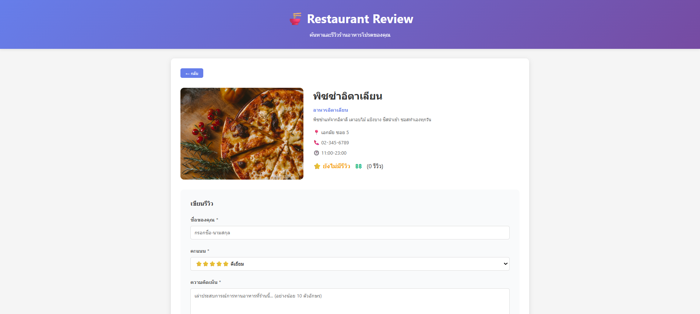
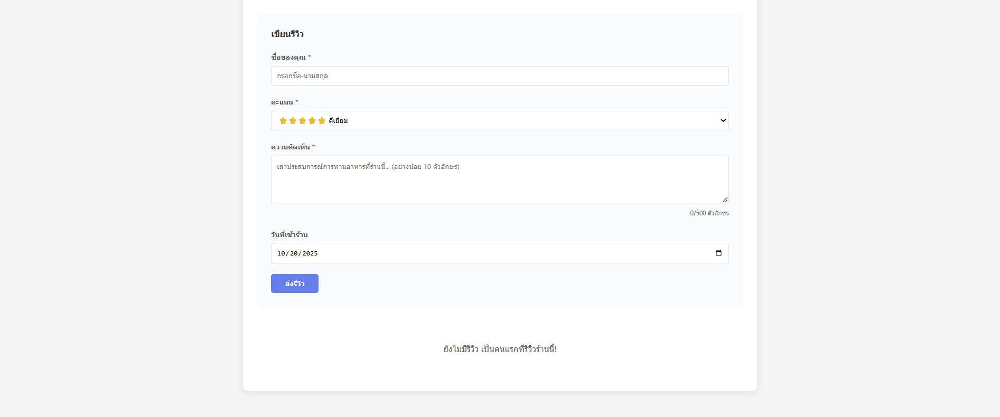

# 🍽️ Restaurant Review Website


## 📖 รายละเอียดโปรเจค
เว็บไซต์รีวิวร้านอาหารที่ให้ผู้ใช้สามารถดูรายการร้านอาหาร ค้นหา กรองตามหมวดหมู่/ราคา/คะแนน ดูรายละเอียดร้าน และเพิ่มรีวิวได้แบบเรียลไทม์  
เหมาะสำหรับผู้ที่ต้องการค้นหาร้านอร่อยและแชร์ประสบการณ์กับผู้อื่น

---

## 🛠️ เทคโนโลยีที่ใช้
| Layer | Technology |
|-------|------------|
| Frontend | React 18 + Vite |
| Backend | Node.js + Express |
| Database | JSON File Storage |

---

## ✨ Features ที่ทำได้

### Required Features (70 คะแนน)
- [x] แสดงรายการร้านอาหาร
- [x] ค้นหาร้าน
- [x] กรองตามหมวดหมู่ / rating / ราคา
- [x] ดูรายละเอียดร้าน
- [x] เพิ่มรีวิว
- [x] Validation
- [x] อัพเดท rating อัตโนมัติ

### Bonus Features (ถ้ามี)
- [ ] Sort restaurants
- [ ] Responsive design
- [ ] Animations

---

## ⚙️ วิธีติดตั้งและรัน

### Backend
```bash
cd backend
npm install
cp .env.example .env
npm run dev

### Frontend
\`\`\`bash
cd frontend
npm install
npm run dev
\`\`\`

🖥️ API Endpoints
| Method | Endpoint | Description |
|--------|---------|------------|
| GET    | /api/restaurants       | ดึงรายการร้านทั้งหมด |
| GET    | /api/restaurants/:id   | ดึงร้านตาม ID พร้อมรีวิว |
| POST   | /api/reviews           | เพิ่มรีวิว |
| GET    | /api/stats             | ดึงสถิติร้านอาหาร/รีวิว |


📸 Screenshots
หน้าแรก (รายการร้าน)



รายละเอียดร้าน



ฟอร์มรีวิว



👨‍💻 ผู้พัฒนา
- นางสาว รัฐจิกาลณ์ กวงคำ
- 67543210063-3
- Parnward7@gmail.com

## License
MIT License
